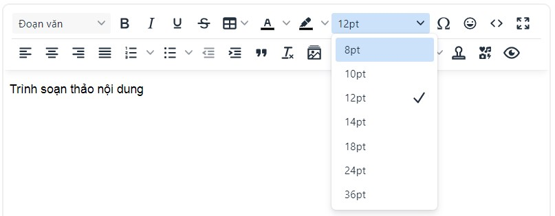
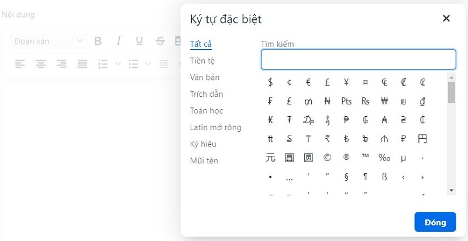
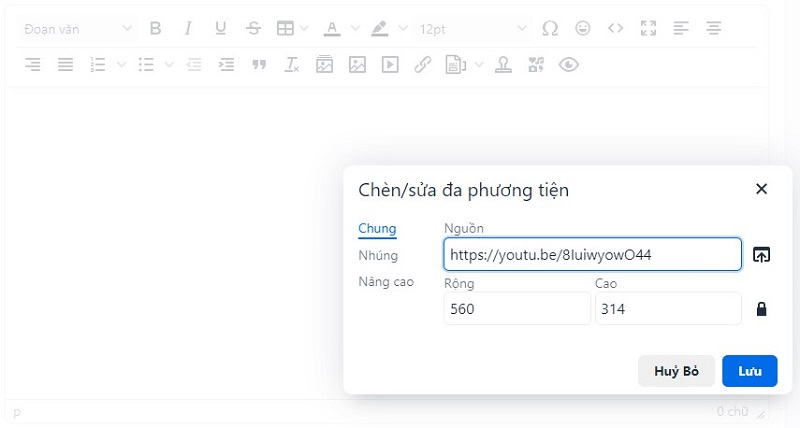
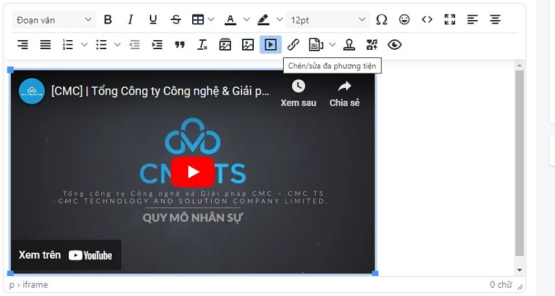
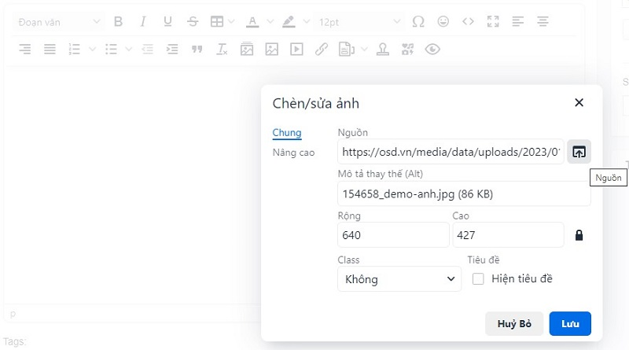
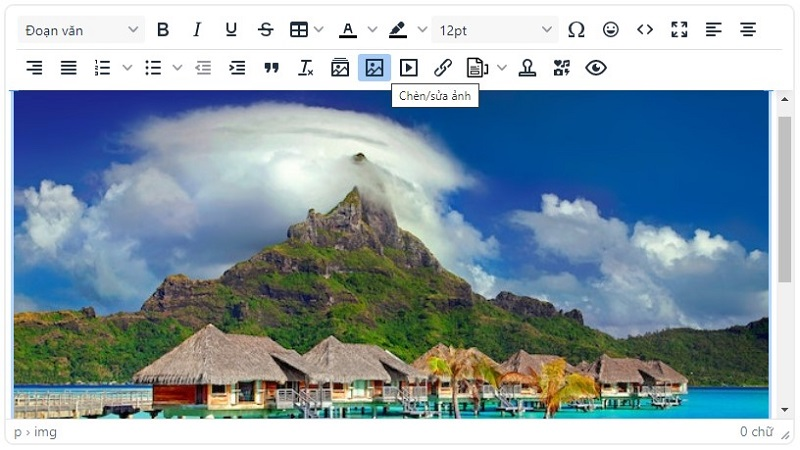
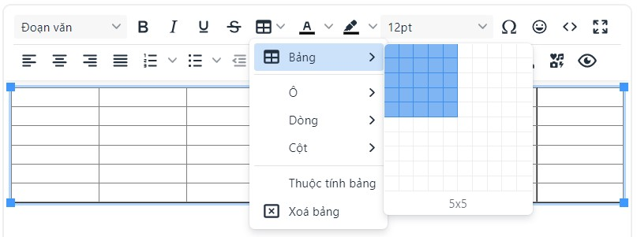

# Trình soạn thảo nội dung

Trình soạn thảo TinyMCE 5 với nhiều tích hợp sâu giúp bạn soạn thảo trực tiếp trên website nhanh chóng và hiệu quả hơn.

**Sơ đồ các tính năng trên thanh công cụ của trình soạn thảo**

Các chức năng được phân thành nhóm chính như sau:

## Chức năng định dạng văn bản
### (1) Trình bày đoạn văn

Tính năng này hữu dụng khi bạn muốn điều khiển hiển thị theo tiêu chuẩn HTML, đặc biệt được nhóm chuyên gia SEO thường xuyên sử dụng khi muốn có bài viết theo heading, paragraph.

Cách thực hiện đơn giản là chọn đoạn văn bản (bôi đen) hoặc đặt con trỏ vào vị trí cần định dạng. Tiếp đến, bạn chọn 1 định dạng cụ thể (Paragraph = đoạn văn, heading (đề mục) từ 1 đến 6, Code = mã nguồn) từ danh sách thả xuống.

Xem thêm tư vấn của OSD.VN về cách định dạng bài viết chuẩn SEO.(WIP)

### (2) Định dạng kiểu chữ đậm

Phím tắt: Ctrl + B (Comand + B trên MacOS X), áp dụng cho đoạn văn bản được chọn hoặc khi đang soạn thảo thì sẽ là đánh dấu kiểu định dạng chữ đậm.

### (3) Định dạng kiểu chữ in nghiêng

Phím tắt: Ctrl + I (Comand + I trên MacOS X), áp dụng cho đoạn văn bản được chọn hoặc khi đang soạn thảo thì sẽ là đánh dấu kiểu định dạng chữ in nghiêng.

### (4) Định dạng kiểu chữ gạch chân

Phím tắt: Ctrl + U (Comand + U trên MacOS X), áp dụng cho đoạn văn bản được chọn hoặc khi đang soạn thảo thì sẽ là trình bày văn bản với kiểu định dạng chữ được gạch chân.

### (5) Định dạng chữ gạch ngang

Trình bày đoạn văn bản dạng gạch ngang, bạn cũng có thể sử dụng tổ hợp phím Ctrl + S hoặc Command + S trên MacOS X.

### (7) Thay đổi màu chữ

Bạn cần chọn đoạn văn bản cần thay đổi màu chữ, sau đó bấm vào nút số (7) => Thực hiện chọn màu mong muốn từ bảng màu hiển thị ra.

Để xóa màu chữ của văn bản, bạn cần bôi đen đoạn văn bản cần xóa màu và chọn nút Remove Color.

### (8) Thay đổi màu nền của văn bản

Tương tự chức năng số (7) được nêu trên, chức năng này cho phép định dạng màu nền của chữ.

### (9) Thay đổi cỡ chữ

Hệ thống chỉ cho phép bạn thay 14 kích cỡ tương ứng từ nhỏ đến lớn theo danh sách.

!> Trong 1 văn bản bạn không nên có nhiều cỡ chữ nhằm giảm sự điều tiết của mắt người đọc.

### (10) Special character

Tính năng lựa chọn kí tự, kí hiệu đặc biệt. Hệ thống chỉ cho phép bạn lựa chọn 7 tùy chọn tương ứng kí tự, kí hiệu theo danh sách tương ứng như sau:

- **Currency** Tiền tệ
- **Text** Chữ
- **Quotations** Báo giá
- **Mathematical** Toán học
- **Extended Latin** Tiếng Lating mở rộng
- **Symbols** Ký hiệu
- **Arrows** Mũi tên

### (11) Emoticons

Tính năng lựa chọn biểu tượng cảm xúc. Hệ thống chỉ cho phép bạn lựa chọn 8 tùy chọn tương ứng biểu tượng cảm xúc theo danh sách tương ứng như sau:

- **Symbols** Ký hiệu
- **People** Mọi người
- **Animals** and Nature Động vật và thiên nhiên
- F**ood and Drink** Đồ ăn và đồ uống
- **Activity** Hoạt động
- **Travel and Places** Du lịch và địa điểm
- **Objects** Các đối tượng
- **Flags** Cờ

### (12) Source code

Tính năng xem mã nguồn của trang web. Để xem chế độ Source code bạn chỉ cần nhấn phím tính năng số (12) trên thanh công cụ, nếu muốn tắt chế độ Source code bạn chỉ cần ấn lại phím số (12) một lần nữa.

### (13) Căn lề đoạn văn bản

Trước hết cần chọn đoạn văn bản cần định dạng hoặc có thể đặt con trỏ tại vị trí cần điều khiển căn lề để chọn 1 trong những cách căn lề: căn giữa, căn trái, căn phải, căn lề 2 bên.

Bạn cũng có thể dùng tổ hợp phím tắt để căn lề cho nội dung bài viết tương tự như MS Words, Google Docs,... cụ thể là:

- Ctrl + J (hoặc Command + J trên MacOS X): căn lề 2 bên
- Ctrl + E (hoặc Command + E trên MacOS X): căn lề giữa
- Ctrl + L (hoặc Command + L trên MacOS X): căn lề trái
- Ctrl + R (hoặc Command + R trên MacOS X): căn lề phải

### (14) Định dạng danh sách đánh số

Number list (danh sách đánh số thứ tự) giúp thể hiện các mục rõ ràng và cụ thể hơn. Thao tác đơn giản là bôi đen nhiều dòng và click chuột vào nút số (14).

### (15) Định dạng danh sách không theo thứ tự

Unordered list (danh sách không theo thứ tự) giúp văn bản sạch và dễ nhìn và bớt đơn điệu. Thao tác đơn giản là bôi đen nhiều dòng và click chuột vào nút số (15).

### (16) Dịch chuyển sang trái 1 khối văn bản

Tính năng này sẽ dịch chuyển khối đoạn văn bản thụt vào bên trái 1 tab.

### (17) Dịch chuyển sang phải 1 khối văn bản

Tính năng này sẽ dịch chuyển khối văn bản thụt vào bên phải 1 tab, chỉ có tác dụng sau khi bạn đã dùng tính năng số (17).

### (18) Trích dẫn văn bản

Thẻ blockquote là thẻ tag dùng để trích dẫn phần văn bản từ một nguồn khác trong html. Tag Blockquote thường được sử dụng trong trích dẫn câu nói của một tác giả nào đó. Hay nhấn mạnh một nội dung nào đó trên bài viết của mình.

### (19) Xóa định dạng văn bản mặc định

Chức năng này được dùng khi các bạn thực hiện copy nội dung từ file MS Word, Google Docs, trực tiếp từ các website khác... khiến định dạng của bài viết không hiển thị theo phong cách chung của website.

### (24) Fullscreen

Tính năng xem toàn màn hình của trình soạn thảo. Để bật chế độ duyệt web toàn màn hình Full Screen bạn chỉ cần nhấn phím tính năng số (24) trên thanh công cụ, nếu muốn tắt chế độ full toàn màn hình bạn chỉ cần ấn lại phím số (24) một lần nữa

### (25) Insert/edit code sample

### (26) Tabs content

### (27) fontawesomepicker

## Cách chèn liên kết (hyperlink)

Nút số (23) trên thanh công cụ dùng để chèn liên kết cho đoạn văn bản. Khi bạn không chọn đoạn văn bản thì hệ thống tự nhận dạng liên kết dạng URL. Xin vui lòng xem hình dưới.

Tùy chọn Open link in Current window sẽ giúp điều khiển mở liên kết trong cùng 1 cửa sổ hiện tại. Tùy chọn này thường được áp dụng khi bạn thực hiện chèn 1 liên kết cùng trang website.

Tùy chọn Open link in New window sẽ giúp điều khiển mở liên kết đó trong 1 cửa sổ mới. Tùy chọn này thường được áp dụng khi bạn thực hiện chèn 1 URL là website bên ngoài. Khi bạn quan tâm tới SEO, việc này sẽ giúp giảm tỉ lệ thoát trang của website.

## Chèn hình ảnh và điều khiển vị trí ảnh

!> Bạn cũng nên tham khảo tư vấn tổ chức thư mục hình ảnh trên hệ thống

(20) Chèn trực tiếp ảnh từ máy tính lên trình soạn thảo nội dung

Bấm vào nơi bạn muốn chèn ảnh

Tại thanh công cụ trên trình soạn thảo, nhấn chọn nút số 20, nhấp chọn ảnh từ máy tính => đường dẫn ảnh sẽ hiển thị tại mục media/data/uploads/{năm/tháng/ngày tự động theo thời gian hiện tại} (ví dụ đường dẫn https://osdvn.vn/media/data/uploads/2022/07/06/162821_ky-thuat-huong-dan-viet-bai-chuan-seo-dat-ket-qua-cao.jpeg)

Để chèn hình ảnh vào bài viết, bạn đặt con trỏ vào vị trí cần chèn, sau đó chọn nút số (21) trên thanh công cụ soạn thảo. Tiếp theo, hệ thống sẽ mở trình quản lý file của hệ thống để bạn có thể chọn 1 hoặc nhiều ảnh => Click phải chuột và bấm Select Files => Ảnh sẽ được chèn vào trong nội dung bài viết.

Bạn click chuột phải tại hình ảnh để thay đổi kích thước như mong muốn.

## Nhúng video (youtube, vimeo, iframe) (22)

Ảnh chụp chức năng chèn video và video hiển thị sau khi được nhúng vào trình soạn thảo.

Cách đơn giản là bạn copy URL trên thanh địa chỉ của youtube, vimeo... vào hộp văn bản. Sau khi thực hiện xong, hệ thống sẽ nhúng video, iframe vào nội dung với chế độ hiển thị chiều rộng vừa khung của trình soạn thảo.

WIP: tham khảo thêm cách tạo kênh và upload video lên youtube

## Thác tác với bảng biểu (6)

!> 70% người dùng truy cập website từ điện thoại với kích thước màn hình nhỏ, khi nội dung được trình bày trong bảng biểu quá nhiều cột dễ gây các trình bày không được như mong muốn. Bạn hết sức cân nhắc tìm cách trình bày phù hợp để nội dung không bị xô lệch trên thiết bị bi động.

Bạn có thể sử dụng nhấn nút Table trong trình soạn thảo để chèn bảng biểu vào nội dung trình soạn thảo.

Khi muốn gộp, tách cột và dòng, thao tác cũng tương tự như bạn thao tác với MS Excel, Google Docs, MS Word...
